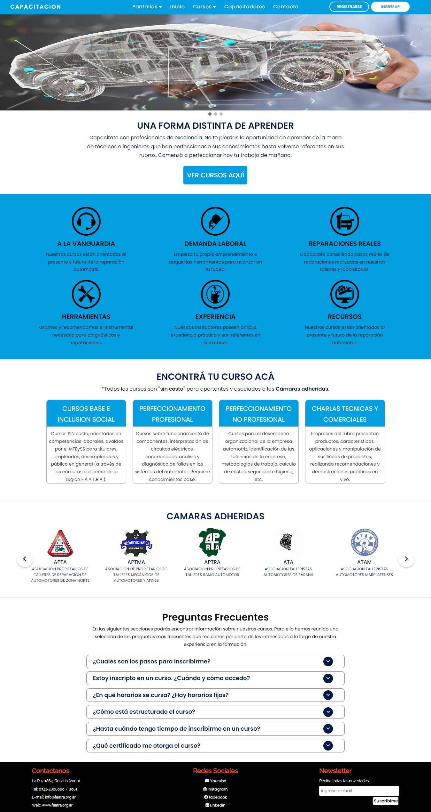

<center>

# Proyecto Final Desarrolo de Sistemas Web 
</center>

## Sistema de capacitación 

Sistema de publicación de presentaciones comerciales, charlas técnicas, cursos base y de perfeccionamiento dirigido a público relacionado al mundo de la reparación del automotor. 
A su ves es una herramienta que permite administrar inscripciones sobre las publicaciones mensionadas.

El sistema consiste en una aplicación Web que le permite a sus Administradores (quienes se autentican con usuario y contraseña) dar de alta y baja eventos, capacitadores, gestionar su inscripción y confeccionar los certificados de asistencia para su envío luego del evento o cuando el participante lo solicite. Para esto, dispondrá de formularios que pueden personalizarse, lo que permitirá definir aspectos como información general del evento, disertantes, modalidades de cursado, entre otros datos.  

## Screenshot Home Web

<center></center>

## Screenshot Home Responsive

<center></center>

## Criterios para su realización:

* Ser Responsiva ✅
* Seguir semántica HTML ✅
* Enlaces para redes sociales ✅
* CSS separado en archivos externos ✅
* Seguir una paleta de colores basada en el logo✅

## Logo

<center></center>
 
## Tema de colores:
```    
    Header
    background_color="029ee0"
    text_color="#ffffff"

    Otros colores
    Principal_color="#ffffff"
    Principal_border_color="#gray"
    Principal_text_color="#001a49"

    secundario_color="f2f2f2"
    secundario_text_color="#6d6d6d"

    Footer
    background_color="#000"
    link_color="#ffffff"
    secundario_border="f5f3f3"
    link_hover_color="#e65b00"

```

## Recursos y tecnologías utilizadas:

* HTML.
* CSS.
* Javascript.
* FontAwesome.
* Google Fonts.
* Git para control de versiones.

## Instrucciones para instalación:

1. Mover la carpeta proyectoIsei2023 al servidor local.
2. Crear la base de datos <strong>capacitación</strong> en MySQL.
3. Importar el archivo capacitacion.sql ubicado en "(proyectoIsei2023/bd/)" a la base de datos creada.
  
## Estructura base de datos
### Diagrama Relacional

<center></center>